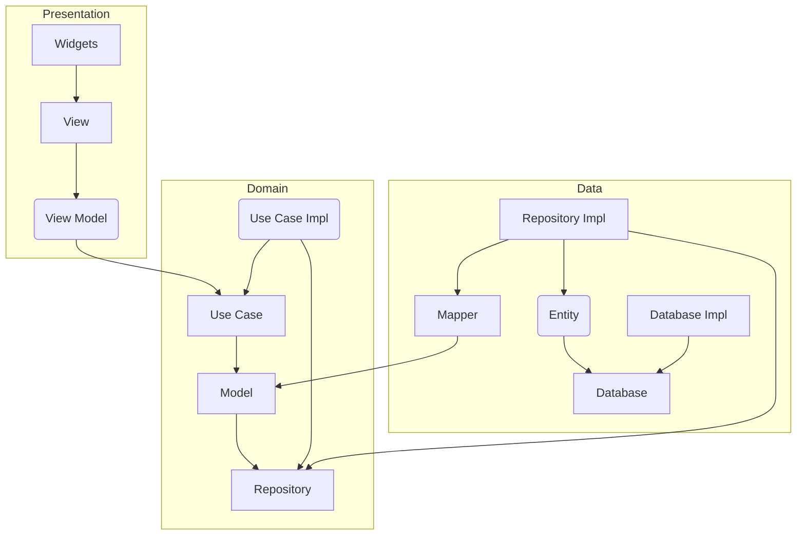

# Clean Architecture Todo App Training With Flutter

Flutter + Clean Architecture + riverpod + drift!

[Online Demo](https://rodydavis.github.io/clean_architecture_todo_app/)!

## Motivation

Based on a [fork](https://github.com/okaryo/CleanArchitectureTodoAppTrainingWithFlutter) and updated for the latest version of Material 3, Riverpod and Drift.

## Architecture Diagram

## Features

- Riverpod
- Riverpod Generator (StreamNotifier/FutureNotifier)
- Drift (SQLite)
- Material 3
- Adaptive Layouts
- All 6 platforms supported
- Full text search
- SQL support
- Dart Code Generation

## Screenshots

